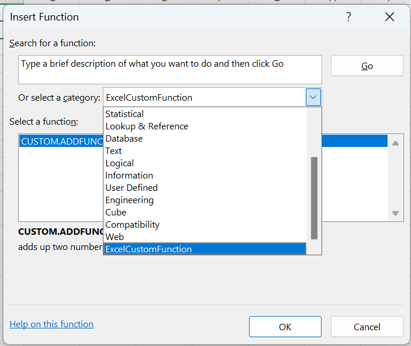
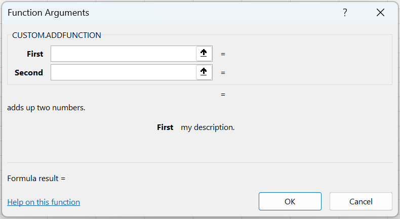
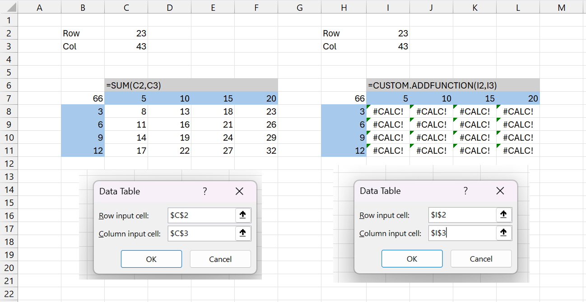

# custom-function-data-table
Excel Office.JS example illustrating how to use a custom function in a data table

Step by Step Tutorial:
https://bettersolutions.com/javascript/custom-functions/creating-with-notepad.htm

 

 

<B>Help Link Working</B>

*) Build the project, upload the files to a https web server and sideload into Excel

*) Select (File > New > Blank workbook)

*) Select (Formulas > Insert Function)

 

*) Select the "CUSTOM.ADDFUNCTION" function

*) Press OK

 

*) Check that the custom function is working correctly

*) Enter the values in cells B2, C2, B3, C4

*) Enter the formula "=SUM(C2,C3)" into cell "B7"

*) Enter the numbers 5, 10, 15, 20 across in row 7

*) Enter the numbers 3, 6, 9, 12 down in column B

*) Highlight cells B7:F11

*) Select Data tab, What If Analysis, Data Table

*) For the row input select cell "C2"

*) For the column input select cell "C3"

*) Press OK - The data table will be populated correctly

 

*) Now lets repeat this using a custom function that adds up two numbers

*) Enter the values in cells H2, I2, H3, I4

*) Enter the formula <B>"=CUSTOM.ADDFUNCTION(I2,I3)"</B> into cell "H7"

*) Enter the numbers 5, 10, 15, 20 across in row 7

*) Enter the numbers 3, 6, 9, 12 down in column B

*) Highlight cells H7:L11

*) Select Data tab, What If Analysis, Data Table

*) For the row input select cell "I2"

*) For the column input select cell "I3"

<B>The data table is not populated and a calculation error is displayed</B>
